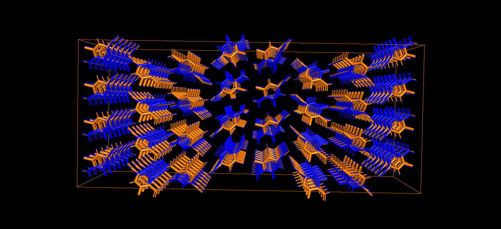

**TO:** Dr. Michael Shirts\
**FROM:** Sam Kennedy\
**DATE:** 17th December, 2021\
**SUBJECT:** Summary of import and energy minimization of crystal structures obtained from Crystallography Open Database (COD)

This memo is to serve as a brief report of my efforts and the issues that were encountered in the import and energy minimization of crystal structures from the Crystallography Open Database (COD). This memo will detail the procedures utilized to download and import a subset of crystalline structures into the OpenMM molecular dynamics simulation package for energy minimization with the OpenFF force field. 
All code and files used for analysis can be found on GitHub[1]. An set of example COD ID values can be run from the GitHub repository to ensure reproducibility of results. 
Choosing Structures from the COD
The first step of analyzing data from the COD was to pick a specific subset of crystalline structures from their database. The COD is a very large and lightly curated database so a smaller subset of crystals had to be chosen for the analysis to be run in a reasonable amount of computing time. Additionally, a large portion of the COD is made up of inorganic crystals, which cannot be simulated using the OpenMM/OpenFF system. 
The baseline search functionality of the COD is very limited and initial attempts at its use were unsuccessful. Instead a snapshot of the COD from June 2020 was inspected through the DataWarrior software package[2] which already has a filtering feature to access only organic structures. The structures were also lumped by a built-in structural similarity feature. From here 289 COD ID numbers were manually identified and selected as the subset of interest (“COD_ID_LIST.txt” on the github repository).
A more exhaustive bench-marking of the database would need to include a more robust selection algorithm which would likely include custom code to parse the CIF file and sort out unusable data entries, such as non-organic molecules or organic molecules with ionic species.
Downloading the Subset and Building Crystal Supercells
Once the COD IDs were identified downloading the CIF files was achieved with simple python scripting. The script “COD_import.py” can be used to retrieve CIF files from the database and also converts those CIF files to the PDB file format using the pybel library[3]. 
Most of the reduced crystal cells that are obtained must be populated with a full crystal structure by executing various symmetry operations. Furthermore, most of the unit cells have dimensions that are less than 0.9nm which is the lower cutoff for periodic boundary conditions (PBC) in OpenMM. To create crystal structures suitable for analysis the open-source python package of PyMol was used[4]. A PyMol  “supercell” function was used to conduct symmetry operations and add copies of the unit cell to satisfy the minimum size requirement imposed by the OpenMM PBC.
Building the OpenMM Topology
In order to conduct the energy minimization within openMM a Topology must be prepared to parameterize the system. The workflow for this procedure is to construct an openFF Molecule object from the initial (non-supercell) PDB file and a SMILES string corresponding to the molecule. The COD has generated SMILES strings for many of their structures and the entire database of SMILES strings was downloaded as “allcod.smi”. This database of SMILES strings was searched for a match to the COD ID number of interest to build the Molecule. This Molecule is then passed with the supercell PDB file to openMM to generate the topology.
Most of the data import errors occur during this process. There were several error cases for this process which caused the import to fail.
1. The SMILES database did not have a string for the COD entry of interest. While the COD has provided strings for a large portion of their database not every entry has a SMILES string[5]. 58 of the 289 COD IDs encountered this error.
2. There is a mismatch between the SMILES string and PDB file. By inspection, it seems that most of these errors come from CIF files that are missing atoms in their sets of coordinates which causes a mismatch between the atom/bonds in the PDB file and the SMILES string. 62 of the 289 COD IDs encountered this error.
3. The stereochemistry is not fully defined or other faulty bonding information. This error seems to come from SMILES strings that do not include specific stereochemistry information required to fully build the Molecule. This error is the most rare of the three occurring only 2 times of the subset of 289.
##Energy Minimization Algorithm
An initial energy minimization is performed with the built-in openMM energy minimization function, which minimizes potential energy by adjusting the positions of the atoms in the system. On this initially minimized system a custom minimization function is called using SciPy minimizer’s application of L-BFGS-B. This main purpose of the custom minimization is to allow for minimization of the periodic boundary conditions. To accomplish this, the positions of each atom are minimized along with the three vectors to describe a tri-clinical periodic boundary (6 variables). The jacobian is also manually supplied to the minimizer, where the position jacobians are the negative of the force calculated by openMM and the box vectors jacobians are calculated by finite difference.

#Results
**Current Issues**
- COD_ID_List.txt is not curated of entries that have data issues (non-matching coordinates between CIF and SMILES and entries without SMILES strings). These entries currently produce errors that are logged in errors.log during execution.
- The current energy minimization algorithm fails for many systems due to periodic cell conditions not being in a reduced format (http://docs.openmm.org/7.0.0/userguide/theory.html#periodic-boundary-conditions).
- The energy minimization algorithm also rarely tries to reduce the periodic boundary conditions to less than 0.9 nm which is half the non-bonded cutoff distance which causes an error. Supercells were expanded by one iteration in the shortest direction but this didn’t alleviate the issue for all systems.
- Modified periodic boundary conditions are not output correctly into the CRYST1 entry of OpenMM generated trajectory. See pdb files for COD ID 4515127 stored in collected_results folder on github where the CRYST1 entries before and after minimization match even though the box vectors changed by a non-negligible amount: 

*Table 1: Comparison of box vectors before and after minimization for COD ID 4515127*

|          | Before Minimization                   | After Minimization                     |
|----------|----------------------------------------|----------------------------------------|
| A Vector | [ 2.2464      0.          0.        ] | [ 2.19241966  0.          0.        ]  |
 | B Vector | [-0.09042594  2.6156374   0.        ] | [-0.16107935  2.6065359   0.        ]  |
 | C Vector | [-0.51473819 -0.18574326  2.84617057] | [-0.51901651 -0.15262663  2.80901304]  |

For most cases where a large RMSD value was observed it appears part of the cell translates across the periodic boundary. It seems that the structure and orientation of these molecules would be correct upon application of the periodic boundary conditions. See the two examples below where the original supercell is colored in orange and the minimized cell is in blue.

*Figure 1: Visualization of COD ID 1519825 before and after minimization*

*Figure 2: Visualization of COD ID 2203241 before and after minimization*

In some cases when the RMSD was low, the overlay shows no such drift (see below).

*Figure 3: Visualization of COD ID 7151616 before and after minimization*

A comparison histogram of RMSD values was generated to compare the performance between OpenFF versions 1.0.0 and 2.0.0. Another plot also compares the distribution of RMSD values after just conducting openMM energy minimization.

*Figure 4: Historgam of RMSD values collected from energy minimization. Top: OpenMM minimzation only. Bottom: Full Box Minimization*

From the comparison above, it appears that the force fields perform similarly for both types of minimization. Additionally, the high frequency of large RMSD values indicates that the molecule transposition issue mentioned above is present for a high portion of samples.
##Conclusions
Import of the data from the COD was difficult due to the poor searching and filtering of the dataset. Also, the COD database of SMILES strings is incomplete and many COD entries do not have a corresponding SMILES string. Beyond missing SMILES strings, many COD entries have CIF files with an incomplete set of coordinates, such that the SMILES string does not match molecule described in the CIF coordinates.
Major issues in the energy minimization are the transposition of molecules in the crystal cell across the periodic boundary leading to high RMSD values and the violation of the periodic boundary conditions being in “reduced” form which causes the energy minimization to fail.

References

[1]	qual5206, qual5206/OpenFFCrystalBenchmarking. 2021. Accessed: Dec. 15, 2021. [Online]. Available: https://github.com/qual5206/OpenFFCrystalBenchmarking
[2]	“www.openmolecules.org.” https://openmolecules.org/datawarrior/datafiles.html (accessed Dec. 15, 2021).
[3]	N. M. O’Boyle, C. Morley, and G. R. Hutchison, “Pybel: a Python wrapper for the OpenBabel cheminformatics toolkit,” Chem. Cent. J., vol. 2, no. 1, p. 5, Dec. 2008, doi: 10.1186/1752-153X-2-5.
[4]	Open-Source PyMOL. Schrodinger, Inc., 2021. Accessed: Dec. 15, 2021. [Online]. Available: https://github.com/schrodinger/pymol-open-source
[5]	M. Quirós, S. Gražulis, S. Girdzijauskaitė, A. Merkys, and A. Vaitkus, “Using SMILES strings for the description of chemical connectivity in the Crystallography Open Database,” J. Cheminformatics, vol. 10, no. 1, p. 23, Dec. 2018, doi: 10.1186/s13321-018-0279-6.
